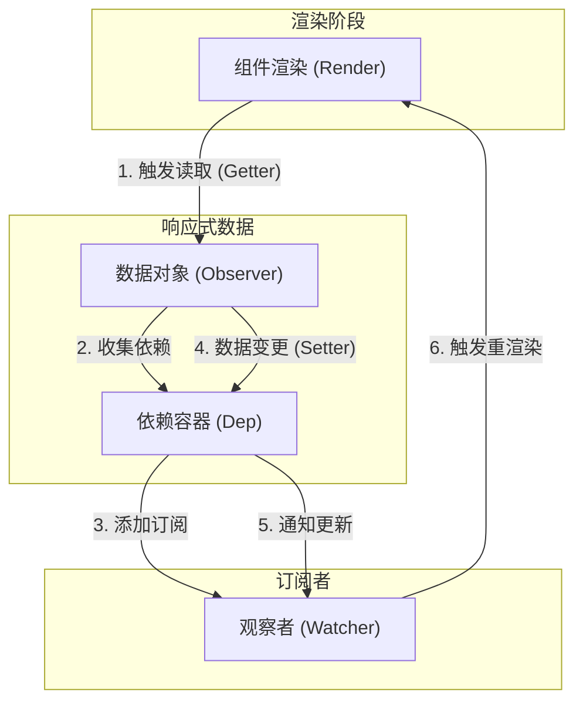

# Vue 基础原理深度剖析

[Vue.js 官方文档](https://cn.vuejs.org/)

本文旨在深入探讨 Vue.js 的核心机制，从源码角度解析响应式系统、模板编译、异步更新队列等关键技术点。

## 1. 响应式系统 (Reactivity System)

Vue 2.x 和 Vue 3.x 的响应式系统实现机制不同，但核心思想一致：**数据劫持** + **发布订阅模式**。

### 1.1 Vue 2.x 实现原理 (Object.defineProperty)

Vue 2 通过 `Object.defineProperty` 将数据对象的属性转换为 getter/setter。

#### 核心类实现

```javascript
// 1. Observer: 递归遍历对象，将属性转换为 getter/setter
class Observer {
  constructor(value) {
    this.value = value;
    if (Array.isArray(value)) {
      // 数组处理：覆盖原型方法
      value.__proto__ = arrayMethods;
      this.observeArray(value);
    } else {
      this.walk(value);
    }
  }

  walk(obj) {
    const keys = Object.keys(obj);
    for (let i = 0; i < keys.length; i++) {
      defineReactive(obj, keys[i]);
    }
  }

  observeArray(items) {
    for (let i = 0; i < items.length; i++) {
      observe(items[i]);
    }
  }
}

// 2. defineReactive: 定义响应式属性
function defineReactive(obj, key, val) {
  // 递归处理子属性
  let childOb = observe(val);

  const dep = new Dep(); // 每个属性闭包中都有一个 Dep

  Object.defineProperty(obj, key, {
    enumerable: true,
    configurable: true,
    get: function reactiveGetter() {
      const value = val;
      if (Dep.target) {
        dep.depend(); // 收集依赖
        if (childOb) {
          childOb.dep.depend(); // 数组依赖收集的关键
        }
      }
      return value;
    },
    set: function reactiveSetter(newVal) {
      if (newVal === val) return;
      val = newVal;
      childOb = observe(newVal); // 新值也需要响应式处理
      dep.notify(); // 触发更新
    },
  });
}

// 3. 数组方法的拦截
const arrayProto = Array.prototype;
const arrayMethods = Object.create(arrayProto);

["push", "pop", "shift", "unshift", "splice", "sort", "reverse"].forEach(
  (method) => {
    const original = arrayProto[method];
    Object.defineProperty(arrayMethods, method, {
      value: function mutator(...args) {
        const result = original.apply(this, args);
        const ob = this.__ob__; // 获取 Observer 实例
        let inserted;
        switch (method) {
          case "push":
          case "unshift":
            inserted = args;
            break;
          case "splice":
            inserted = args.slice(2);
            break;
        }
        if (inserted) ob.observeArray(inserted); // 侦测新增元素
        ob.dep.notify(); // 手动触发更新
        return result;
      },
    });
  },
);
```

### 1.2 Vue 3.x 实现原理 (Proxy)

Vue 3 使用 ES6 `Proxy` 代理整个对象，可以直接拦截对象的增删改查。

```javascript
function reactive(target) {
  if (!isObject(target)) return target;

  const handler = {
    get(target, key, receiver) {
      // 收集依赖 (track)
      track(target, key);
      const res = Reflect.get(target, key, receiver);
      // 懒代理：只有访问时才递归
      return isObject(res) ? reactive(res) : res;
    },
    set(target, key, value, receiver) {
      const oldValue = target[key];
      const result = Reflect.set(target, key, value, receiver);
      // 触发更新 (trigger)
      if (value !== oldValue) {
        trigger(target, key);
      }
      return result;
    },
    deleteProperty(target, key) {
      const result = Reflect.deleteProperty(target, key);
      trigger(target, key);
      return result;
    },
  };

  return new Proxy(target, handler);
}
```

---

## 2. 依赖收集与派发更新 (Dep & Watcher)

Vue 的响应式系统依赖于 `Dep` (Dependency) 和 `Watcher` (观察者) 的配合。

### 2.1 关系图谱



- **Data (Observer)**: 被观察的数据对象。
- **Dep**: 依赖容器，每个响应式属性对应一个 Dep 实例。
- **Watcher**: 订阅者，可以是组件的 Render Watcher，也可以是用户定义的 Computed 或 Watch。

**多对多关系**：

- 一个组件 (Watcher) 可以依赖多个数据属性 (Dep)。
- 一个数据属性 (Dep) 可以被多个组件 (Watcher) 依赖。

### 2.2 核心流程

1.  **Render 阶段**: 组件渲染时，会创建一个 `Render Watcher`，并将 `Dep.target` 指向该 Watcher。
2.  **Getter 触发**: 渲染过程中访问 `data` 属性，触发 `getter`。
3.  **依赖收集**: `Dep` 将当前的 `Dep.target` (Watcher) 添加到自己的 `subs` 列表中 (`dep.depend()`)。同时 Watcher 也会将 Dep 添加到自己的 `deps` 列表中 (用于 cleanup)。
4.  **Setter 触发**: 数据修改，触发 `setter`。
5.  **派发更新**: `Dep` 遍历 `subs`，调用每个 Watcher 的 `update()` 方法 (`dep.notify()`)。

---

## 3. 异步更新队列 (NextTick)

Vue 在更新 DOM 时是**异步**的。只要侦听到数据变化，Vue 将开启一个队列，并缓冲在同一事件循环中发生的所有数据变更。

### 3.1 为什么要异步更新？

如果每次数据修改都直接更新 DOM，性能消耗极大。例如 `this.a = 1; this.b = 2;` 会触发两次 DOM 更新。通过异步队列，Vue 可以**去重** (Deduplication)，确保每个组件在一次 tick 中只更新一次。

### 3.2 实现原理

1.  **queueWatcher**: 当 Watcher 被触发 `update()` 时，并非立即执行，而是调用 `queueWatcher(this)`。
2.  **去重**: 检查 `has` map，如果该 Watcher 已在队列中，则跳过。
3.  **flushSchedulerQueue**: 在下一个 tick 执行队列中的所有 Watcher 的 `run()` 方法。

### 3.3 nextTick 降级策略

Vue 内部通过 `timerFunc` 实现异步延迟。优先级如下：

- **Vue 2.x**: `Promise` > `MutationObserver` > `setImmediate` > `setTimeout`。
- **Vue 3.x**: 主要是 `Promise.resolve().then()`。

```javascript
// 简化的 nextTick 实现
const callbacks = [];
let pending = false;

function flushCallbacks() {
  pending = false;
  const copies = callbacks.slice(0);
  callbacks.length = 0;
  for (let i = 0; i < copies.length; i++) {
    copies[i]();
  }
}

let timerFunc;
if (typeof Promise !== "undefined") {
  const p = Promise.resolve();
  timerFunc = () => {
    p.then(flushCallbacks);
  };
} else {
  // 降级处理...
  timerFunc = () => {
    setTimeout(flushCallbacks, 0);
  };
}

export function nextTick(cb, ctx) {
  callbacks.push(() => {
    if (cb) cb.call(ctx);
  });
  if (!pending) {
    pending = true;
    timerFunc();
  }
}
```

---

## 4. 模板编译 (Template Compilation)

Vue 的编译器将模板 (`template`) 转换为渲染函数 (`render function`)。

### 4.1 编译三部曲

1.  **Parse (解析)**: 将模板字符串解析为抽象语法树 (**AST**)。
    - 使用正则表达式匹配标签、属性、文本。
    - 生成类似 `{ tag: 'div', attrs: {}, children: [...] }` 的对象树。
2.  **Optimize (优化)**: 遍历 AST，标记**静态节点** (Static Roots)。
    - 静态节点 (如纯文本、无绑定的标签) 在 Diff 过程中会被跳过，不需要重新比对。
    - 这是 Vue 2 性能优化的关键步骤。
3.  **Generate (生成)**: 将 AST 转换为渲染函数的代码字符串。
    - 例如: `_c('div', { attrs: { id: "app" } }, [_v("hello")])`。

### 4.2 运行时 vs 完整版

- **Runtime Only**: 不包含编译器。需要配合 webpack 的 `vue-loader` 预编译模板。体积小 (少 ~30%)。
- **Runtime + Compiler**: 包含编译器。可以直接在客户端编译 `template` 选项。

---

## 5. MVVM 模型详解

**MVVM** (Model-View-ViewModel) 是 Vue 的设计模式。

- **Model (模型)**: JavaScript 对象 (data)。
- **View (视图)**: DOM (template)。
- **ViewModel (视图模型)**: Vue 实例。

**核心**: ViewModel 是连接 View 和 Model 的桥梁。

- **Data Bindings**: Model 变化自动更新 View。
- **DOM Listeners**: View 交互自动更新 Model。

Vue 实现了 **双向绑定** (Two-Way Binding)，但主要遵循 **单向数据流** (One-Way Data Flow) 原则 (尤其在父子组件通信中)。
