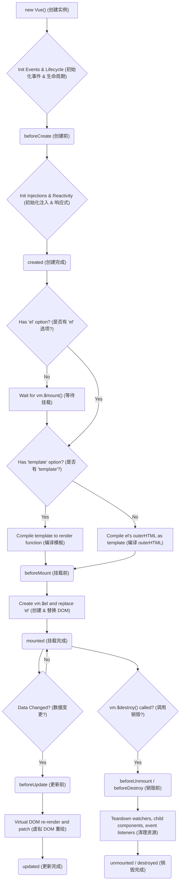

# 生命周期深度解析与实战

[Vue.js 官方文档](https://cn.vuejs.org/)

Vue 实例从创建到销毁的过程称为生命周期。理解生命周期对于处理数据初始化、DOM 操作、资源清理至关重要。

<VueLifecycleDemo />

## 1. 生命周期全景图 (Mermaid)



## 2. 核心阶段深度剖析

### 2.1 初始化阶段 (Initialization)

#### beforeCreate

- **时机**: 实例刚被创建，组件的 `options` 对象已合并，但**数据观测 (data observer)** 和 **事件机制** 尚未初始化。
- **状态**: `data`, `computed`, `watch`, `methods` 均为 `undefined`。
- **常见用途**: 初始化非响应式变量，或者在 Vue 插件中混入全局逻辑。

#### created

- **时机**: 实例创建完成。**依赖注入 (Provide/Inject)** 和 **响应式系统** 已初始化。
- **状态**: 可以访问 `data` 和 `methods`。但 DOM 尚未生成，`$el` 为不可用。
- **常见用途**:
  - 发送 Ajax 请求获取初始数据。
  - 初始化 WebSocket 连接。
  - 访问 `this.$router` 或 `this.$store`。

### 2.2 挂载阶段 (Mounting)

#### beforeMount

- **时机**: 模板编译完成，生成了 `render` 函数。即将开始首次 DOM 渲染。
- **状态**: 虚拟 DOM 已经创建，但真实 DOM 尚未挂载。
- **注意**: 在服务端渲染 (SSR) 中，这是客户端激活前的最后一个钩子。

#### mounted

- **时机**: 组件已挂载到页面上。`vm.$el` 已替换掉页面上的 `el`。
- **状态**: 可以操作真实 DOM。
- **常见用途**:
  - 启动第三方库 (Chart.js, D3, Mapbox)。
  - 绑定自定义事件监听器 (如 `window.resize`)。
  - 操作 DOM 元素 (如获取宽高等)。
- **坑点**:
  - `mounted` **不保证**所有子组件也都挂载完成。如果需要等待整个视图渲染完毕，需使用 `this.$nextTick`。

### 2.3 更新阶段 (Updating)

#### beforeUpdate

- **时机**: 响应式数据更新，虚拟 DOM 打补丁之前。
- **用途**: 在 DOM 更新前访问现有的 DOM，例如手动移除已添加的事件监听器，或获取更新前的滚动条位置。

#### updated

- **时机**: 虚拟 DOM 重新渲染并应用到真实 DOM 之后。
- **用途**: 执行依赖于 DOM 更新后的操作。
- **警告**: **禁止**在此钩子中更改数据，否则会导致无限循环更新！

### 2.4 销毁阶段 (Destruction)

#### beforeUnmount (Vue 3) / beforeDestroy (Vue 2)

- **时机**: 组件实例即将被销毁。此时实例仍然完全可用。
- **关键任务 (内存泄漏防护)**:
  - 清除定时器 (`clearInterval`, `clearTimeout`)。
  - 解绑全局事件 (`window.removeEventListener`)。
  - 销毁第三方实例 (如编辑器对象)。

#### unmounted (Vue 3) / destroyed (Vue 2)

- **时机**: 组件已完全销毁。
- **状态**: 所有指令解绑，所有事件监听器移除，所有子组件实例销毁。

## 3. 特殊生命周期

### 3.1 keep-alive 缓存组件

当组件被 `<keep-alive>` 包裹时，它不会被销毁，而是进入缓存状态。

- **activated**: 组件被激活 (进入视图) 时调用。
- **deactivated**: 组件被停用 (离开视图) 时调用。

### 3.2 错误处理

- **errorCaptured(err, vm, info)**: 捕获一个来自后代组件的错误时被调用。
  - 返回 `false` 可以阻止错误继续向上传播。

## 4. 父子组件生命周期执行顺序 (面试必问)

这是一个非常经典的面试题，理解它有助于解决复杂的组件通信问题。

### 4.1 加载渲染过程

遵循 **"洋葱模型"**，由外向内初始化，由内向外挂载。

1.  **父** beforeCreate
2.  **父** created
3.  **父** beforeMount
4.  **子** beforeCreate
5.  **子** created
6.  **子** beforeMount
7.  **子** mounted
8.  **父** mounted

**记忆口诀**: 父组件先把子组件准备好 (解析模板)，子组件自己挂载完了，父组件才算挂载完。

### 4.2 更新过程

1.  **父** beforeUpdate
2.  **子** beforeUpdate
3.  **子** updated
4.  **父** updated

### 4.3 销毁过程

1.  **父** beforeUnmount
2.  **子** beforeUnmount
3.  **子** unmounted
4.  **父** unmounted

## 5. 实战场景：如何在 created 中操作 DOM？

在 `created` 阶段，DOM 尚未生成。如果必须操作，可以通过 `this.$nextTick` 回调：

```javascript
created() {
  this.$nextTick(() => {
    // 此时 DOM 已渲染
    document.getElementById('chart').innerHTML = '...';
  });
}
```

但通常建议将此类逻辑放在 `mounted` 中。
